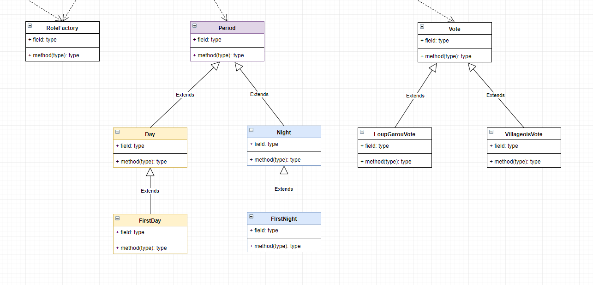

# Documentation du Loup Garou

## Normes


### Programmation Orientée Objet

Pour le développement de ce jeu, une approche orientée objet paraît nécessaire. Le Javascript permet ce paradigme de programmation, c'est donc celui utilisé lors du développement de ce jeu.



### ES6

 La norme utilisé est la **norme ES6**, ce qui induit notamment les **arrow function**, les **promises**, et le **async**/**await**. Une bonne connaissance de ces notions est nécessaire au développement de ce jeu. L'**événementiel** et le **parallélisme** sont des éléments clés qui se retrouvent dans le code.



### Discord.js

[La bibliothèque discord.js](https://discord.js.org) est celle utilisé pour le bot, compatible avec les normes mentionnées précédemment.


## Conception

Le [diagramme d'activité](https://mm.tt/988096194?t=Yv7gSj21yQ) et le [diagramme de classe](https://drive.google.com/file/d/1Zkj_kca4FDg3JyzfZp1QytiUNYi5WJSK/view?usp=sharing) sont les deux piliers où repose la conception.

